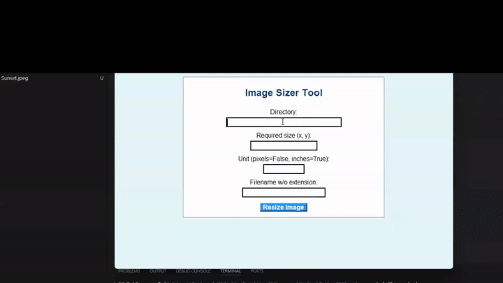

# Imazer

A lightweight Python GUI application for batch image resizing — built for quick, intuitive image manipulation without needing to touch the command line.

  

## Overview
Imazer lets users resize images individually or in batches across multiple formats through a simple graphical interface — no scripting required. It was built as a self-driven project to explore GUI design and image processing in Python.



## Features
- Batch resizing across multiple images at once
- Support for multiple image formats
- Simple, intuitive GUI — no command line needed
- Robust error handling for invalid files/formats

## Tech Stack
- **Python** — core application logic
- **PIL (Pillow)** — image processing and manipulation
- **Tkinter** — GUI framework

## How It Works
1. Launch the application
2. Select the image(s) or folder you want to resize
3. Choose your target dimensions/format
4. Imazer processes and outputs the resized images

## Getting Started
```bash
# Clone the repo
git clone https://github.com/subhasrivijay/Imazer.git
cd Imazer

# Install dependencies
pip install pillow

# Run the app
python main.py
```

## Motivation
Built to practice designing an intuitive, error-resistant GUI on top of core Python image-processing libraries — with an emphasis on smooth batch handling and reliable performance across formats.
